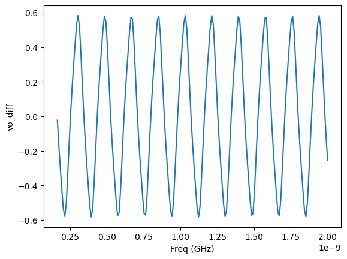

# CACE Summary for diff_ring_oscillator

**netlist source**: schematic

|      Parameter       |         Tool         |     Result      | Min Limit  |  Min Value   | Typ Target |  Typ Value   | Max Limit  |  Max Value   |  Status  |
| :------------------- | :------------------- | :-------------- | ---------: | -----------: | ---------: | -----------: | ---------: | -----------: | :------: |
| Freq                 | ngspice              | frequency            |         4.2 GHz |  5.414 GHz |      5.4 GHz |  5.414 GHz |      7.1 GHz |  5.414 GHz |   Pass ✅    |

## Plots

## frequency

